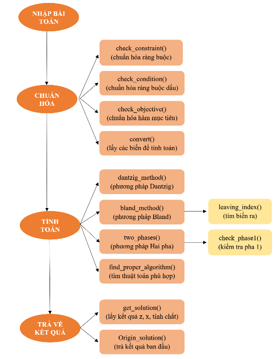
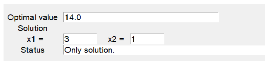

## Linear programming Optimization

## 👉 Object

Xây dựng một giao diện app xử lý bài toán tối ưu. Các giai đoạn gồm: Chuẩn hoá bài toán, Áp dụng các thuật toán tối ưu `Dant_zig`, `Bland`, `Hai pha` để giải bài toán

## 👀 Results

## ✍️ Authors

Nguyễn Thị Hồng Thi
Lê Thị Mỹ Hằng
Mai Thị Thảo Ly

